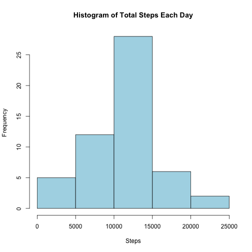
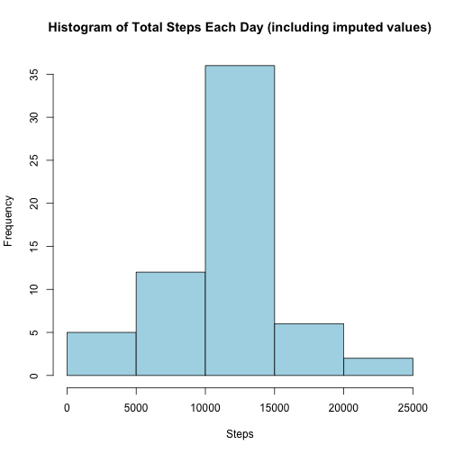
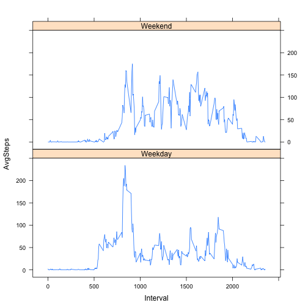

# Reproducible Research: Peer Assessment 1


## Loading and preprocessing the data

```r
activity <- read.csv("activity.csv")
stepsByDay <- aggregate(list(Steps=activity$steps), by=list(Date=activity$date), FUN=sum)
avgStepsByInterval <- aggregate(list(AvgSteps=activity$steps), by=list(Interval=activity$interval), FUN=mean, na.rm=TRUE)
```


## What is mean total number of steps taken per day?

```r
hist(stepsByDay$Steps, main="Histogram of Total Steps Each Day", xlab="Steps", col="lightblue")
```

 

Mean:

```r
mean(stepsByDay$Steps, na.rm=TRUE)
```

```
## [1] 10766
```
Median:

```r
median(stepsByDay$Steps, na.rm=TRUE)
```

```
## [1] 10765
```
## What is the average daily activity pattern?

```r
plot(avgStepsByInterval$Interval, avgStepsByInterval$AvgSteps, type="l", main="Daily Activity Pattern", sub="Average number of steps by Interval", ylab="Average Steps", xlab="Interval")
```

 

Interval with highest (average) number of steps:

```r
avgStepsByInterval[avgStepsByInterval$AvgSteps == max(avgStepsByInterval$AvgSteps, na.rm=TRUE),]$Interval
```

```
## [1] 835
```


## Imputing missing values
Total number of missing values:

```r
sum(is.na(activity$steps))
```

```
## [1] 2304
```

Strategy for imputing missing values: fill with average value for the given interval.

```r
## define function to lookup Average Steps given an interval
getAvgSteps <- function(interval) { 
      avgStepsByInterval[avgStepsByInterval$Interval == interval,]$AvgSteps 
      }
## create imputed data frame
imputed <- activity
## populate step values
imputed[1] <- as.numeric(apply(activity, 1, function(x) {if(is.na(x[1])) getAvgSteps(as.numeric(x[3])) else x[1] }))
## create average data for imputed set
imputedStepsByDay <- aggregate(list(Steps=imputed$steps), by=list(Date=imputed$date), FUN=sum)
```

Averages for Imputed Data Set:

```r
hist(imputedStepsByDay$Steps, main="Histogram of Total Steps Each Day (including imputed values)", xlab="Steps", col="lightblue")
```

 

Mean (including imputed values):

```r
mean(imputedStepsByDay$Steps)
```

```
## [1] 10766
```
Median (including imputed values):

```r
median(imputedStepsByDay$Steps)
```

```
## [1] 10766
```

The above data shows an (expected) increased "peak" in the histogram -- i.e., more data exist. However, the mean remains unchanged, and the median value is increased by only one step per day.

## Are there differences in activity patterns between weekdays and weekends?

```r
## Add Weekend/Weekday factor to activity data
activity$wend <- as.factor(ifelse(weekdays( as.Date(activity$date)) %in% c("Saturday","Sunday"), "Weekend", "Weekday")) 
## recalculate averages by interval
avgStepsByIntervalWend <- aggregate(list(AvgSteps=activity$steps), by=list(Interval=activity$interval, Wend=activity$wend), FUN=mean, na.rm=TRUE)
## Plot graph
library(lattice)
xyplot(AvgSteps ~ Interval | Wend, avgStepsByIntervalWend, type="l", layout=c(1,2))
```

 
